# 🚀 CloudDevOpsProject

## Enterprise-Style End-to-End DevOps & GitOps Platform on AWS

CloudDevOpsProject is a production-oriented DevOps implementation designed to demonstrate modern cloud-native deployment practices using AWS, Kubernetes, GitOps, Infrastructure as Code (IaC), and CI/CD automation.

This project simulates a real-world enterprise deployment workflow starting from infrastructure provisioning all the way to automated application delivery inside Amazon EKS.

---

# 📌 Project Highlights

* Automated AWS Infrastructure Provisioning using Terraform
* Configuration Management using Ansible
* CI/CD Pipeline Automation using Jenkins
* Containerization using Docker
* Kubernetes Orchestration using Amazon EKS
* GitOps Continuous Deployment using ArgoCD
* Secure Container Image Scanning using Trivy
* Public Application Exposure using AWS Application Load Balancer (ALB)
* Modular Infrastructure Design
* Production-Style DevOps Workflow

---

# 🏗️ Solution Architecture

The following architecture represents the complete DevOps workflow implemented in this project.

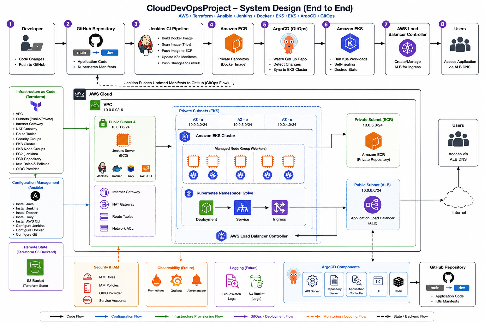

---

# ⚙️ Technologies Used

| Category                 | Technology              |
| ------------------------ | ----------------------- |
| Cloud Provider           | AWS                     |
| Infrastructure as Code   | Terraform               |
| Configuration Management | Ansible                 |
| CI/CD                    | Jenkins                 |
| Containerization         | Docker                  |
| Container Registry       | Amazon ECR              |
| Orchestration            | Kubernetes (Amazon EKS) |
| GitOps                   | ArgoCD                  |
| Security Scanning        | Trivy                   |
| Load Balancer            | AWS ALB                 |
| Version Control          | Git & GitHub            |
| Package Manager          | Helm                    |
| Operating System         | Ubuntu Linux            |

---

# 🧠 DevOps Workflow

```text
Developer
   ↓
GitHub Repository
   ↓
Jenkins CI Pipeline
   ↓
Docker Image Build
   ↓
Trivy Security Scan
   ↓
Push Image to Amazon ECR
   ↓
Update Kubernetes Manifests
   ↓
Push Changes to GitHub
   ↓
ArgoCD Detects Changes
   ↓
Deploy to Amazon EKS
   ↓
AWS Load Balancer Controller
   ↓
AWS Application Load Balancer
   ↓
Public Application Access
```

---

# 📂 Project Structure

```text
CloudDevOpsProject/
│
├── Terraform/
│   ├── modules/
│   │   ├── network/
│   │   ├── server/
│   │   ├── eks/
│   │   └── ecr/
│   │
│   ├── provider.tf
│   ├── backend.tf
│   ├── variables.tf
│   ├── outputs.tf
│   └── terraform.tfvars
│
├── ansible/
│   ├── playbooks/
│   ├── roles/
│   ├── inventories/
│   └── ansible.cfg
│
├── app/
│   └── Dockerfile
│
├── k8s/
│   └── base/
│       ├── namespace.yaml
│       ├── deployment.yaml
│       ├── service.yaml
│       └── ingress.yaml
│
├── argocd/
│   └── application.yaml
│
├── vars/
│   ├── buildImage.groovy
│   ├── scanImage.groovy
│   ├── pushImage.groovy
│   ├── updateManifests.groovy
│   └── pushManifests.groovy
│
├── screenshot/
│   ├── terraform/
│   ├── aws/
│   ├── jenkins/
│   ├── kubernetes/
│   ├── argocd/
│   └── application/
│
├── Jenkinsfile
└── README.md
```

---

# ☁️ AWS Infrastructure Provisioning

Infrastructure provisioning was fully automated using Terraform with reusable modular architecture.

## Infrastructure Components

### 🌐 Network Module

Responsible for provisioning:

* VPC
* Public Subnets
* Private Subnets
* NAT Gateway
* Internet Gateway
* Route Tables
* Security Groups

---

### 🖥️ Server Module

Responsible for provisioning:

* Jenkins EC2 Instance
* Jenkins Security Group

---

### ☸️ EKS Module

Responsible for provisioning:

* Amazon EKS Cluster
* Managed Node Groups
* Worker Nodes
* Kubernetes Networking

---

### 📦 ECR Module

Responsible for provisioning:

* Amazon Elastic Container Registry (ECR)

---

# 🗄️ Terraform Remote Backend

Terraform state management was configured using:

* Amazon S3 for remote state storage
* DynamoDB for state locking

This implementation improves:

* Team collaboration
* Infrastructure consistency
* State protection
* Concurrent deployment safety

---

## Terraform Plan

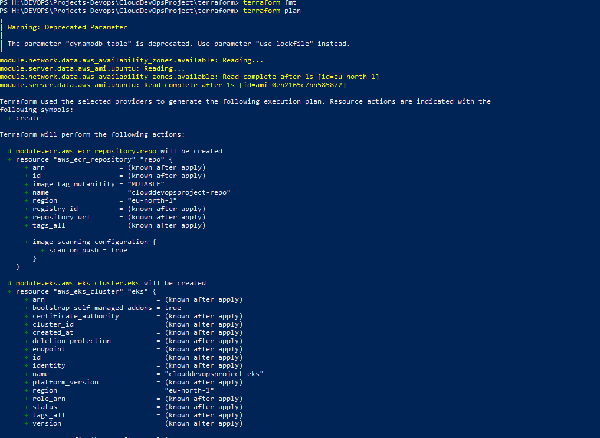

---

## Terraform Apply

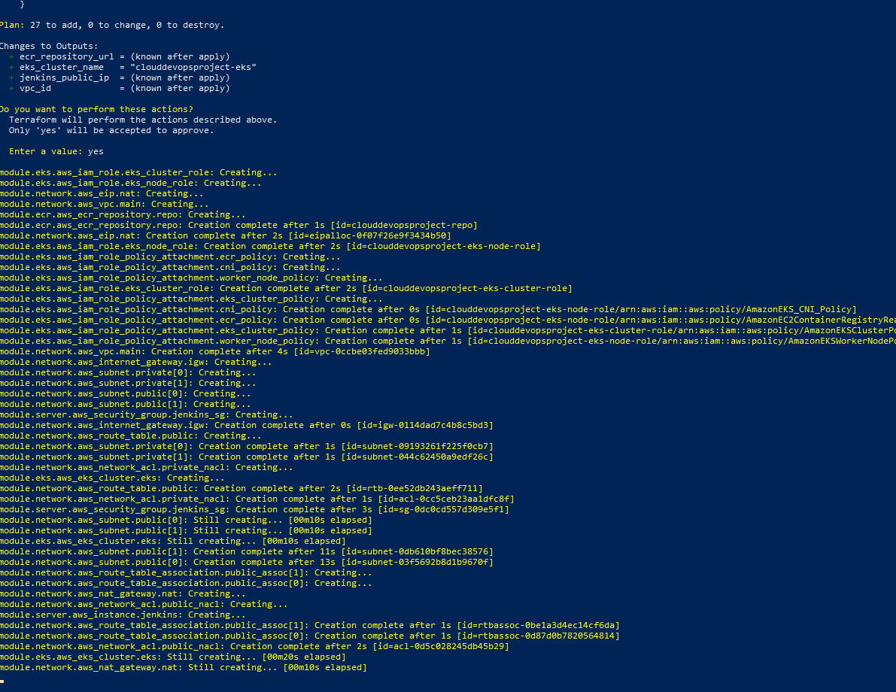

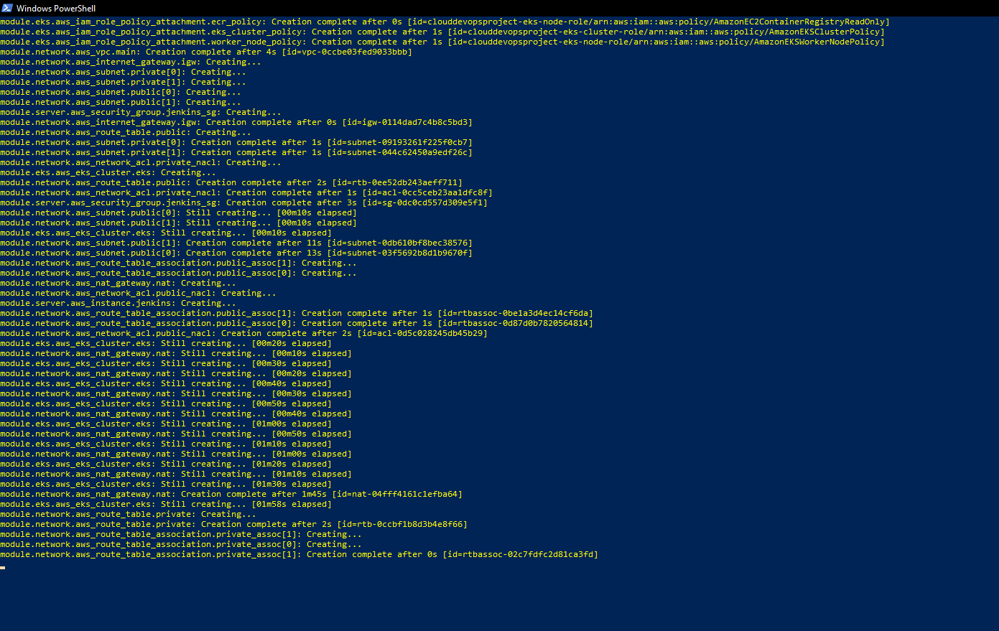

---

## Amazon S3 Backend


---

## DynamoDB State Locking


---

## Amazon EKS Cluster

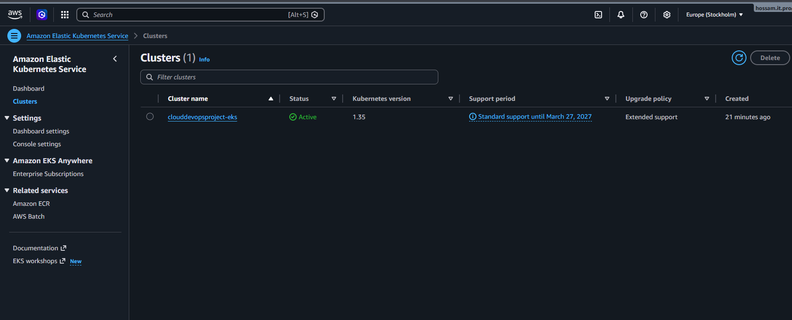

---

## EKS Node Group

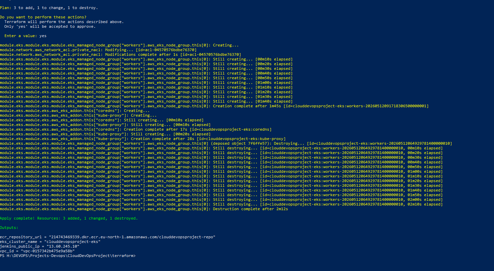

---

# 🐳 Docker Containerization

The application was containerized using Docker.

## Docker Responsibilities

* Application packaging
* Environment consistency
* Dependency isolation
* Reproducible deployments

---

## Build Docker Image

```bash
docker build -t clouddevopsproject .
```

---

## Run Docker Container

```bash
docker run -p 5000:5000 clouddevopsproject
```

---

# 🔧 Jenkins Configuration with Ansible

Ansible was used to automate Jenkins EC2 configuration and software installation.

## Installed Components

* Jenkins
* Docker
* AWS CLI
* kubectl
* Trivy
* Git
* Java

---

## Execute Playbook

```bash
cd ansible

ANSIBLE_CONFIG=$PWD/ansible.cfg \
ansible-playbook playbooks/jenkins.yml
```

---

## Jenkins Installation

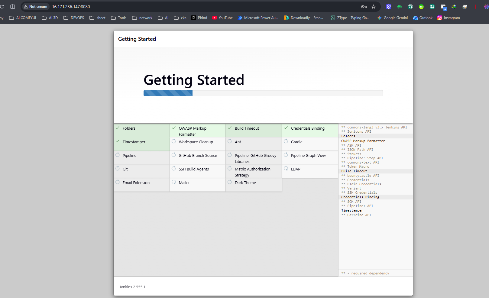

---

## Jenkins Admin User

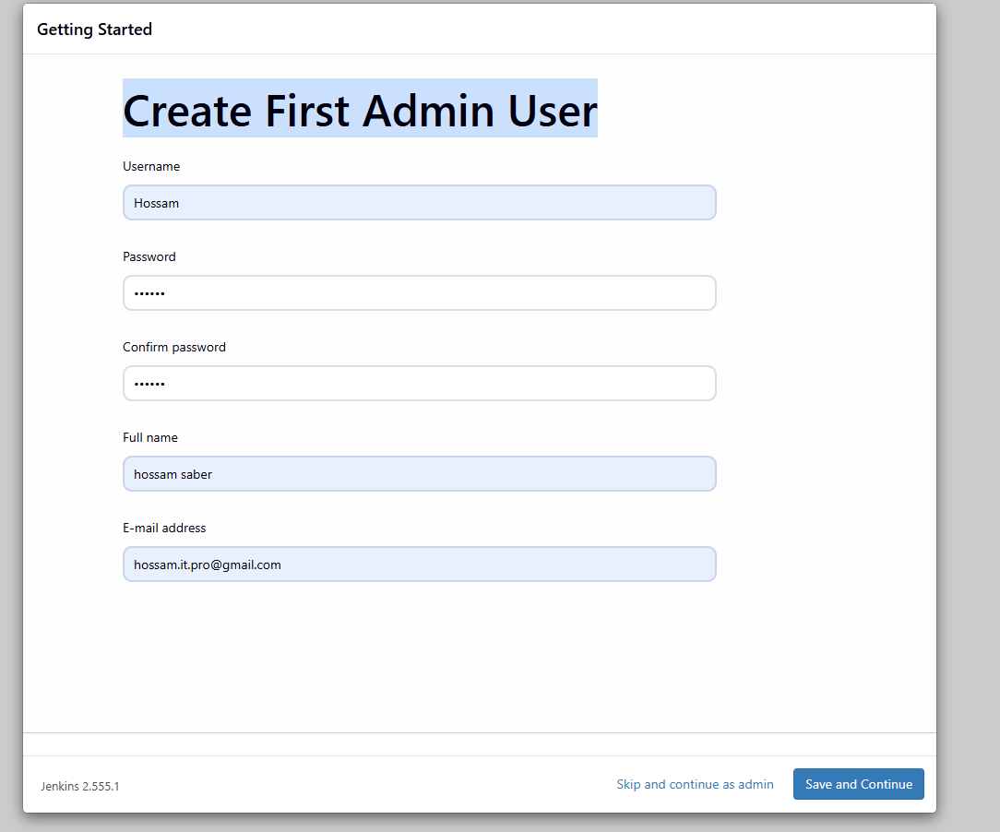

---

## Jenkins URL Configuration

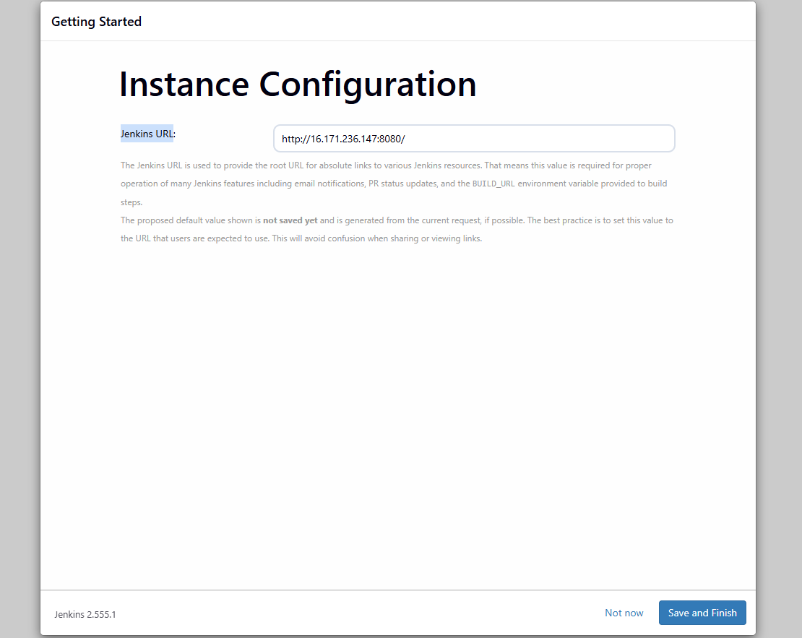

---

# 🔄 Jenkins CI/CD Pipeline

The Jenkins pipeline automates the complete software delivery lifecycle.

## Pipeline Stages

1. Clone Source Code
2. Build Docker Image
3. Scan Image using Trivy
4. Push Image to Amazon ECR
5. Update Kubernetes Manifest
6. Push Manifest Changes to GitHub
7. Trigger GitOps Deployment

---

## Jenkins Pipeline Success

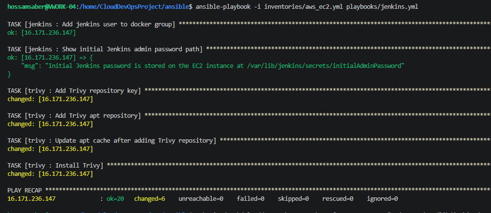

---

## Jenkins Pipeline Failure Example

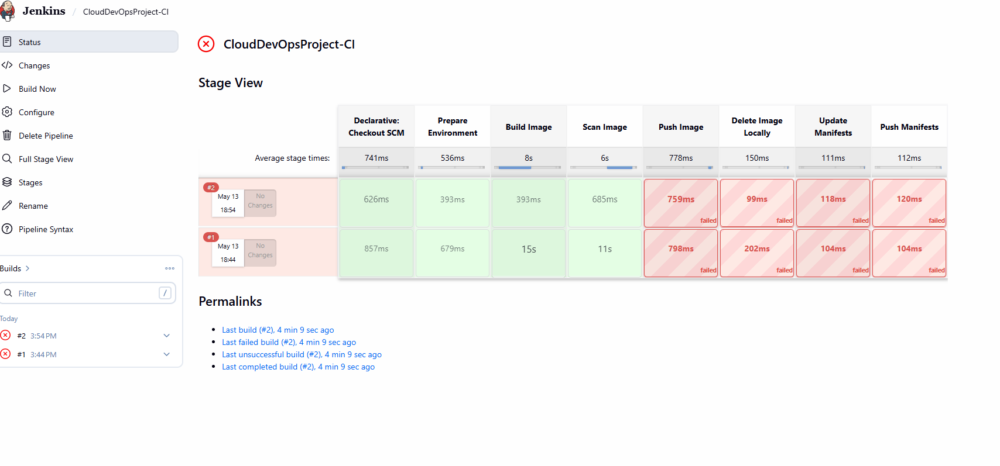

---

# ☸️ Kubernetes Deployment on Amazon EKS

The application was deployed into Amazon EKS using Kubernetes manifests.

## Kubernetes Resources

* Namespace
* Deployment
* Service
* Ingress

---

## Deploy Resources

```bash
kubectl apply -f k8s/base/
```

---

## Kubernetes Verification

### kubectl get nodes

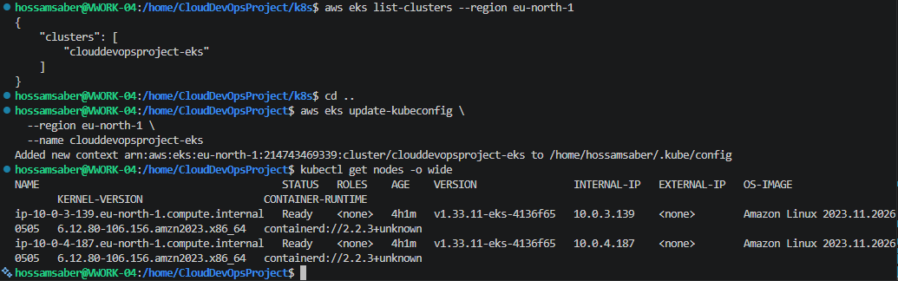

---

### kubectl get all

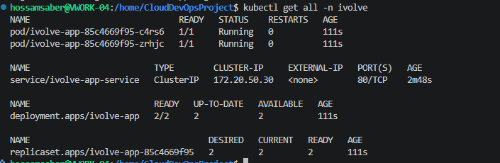

---

### kubectl get pods

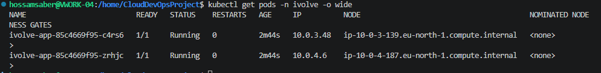

---

### kubectl get ingress

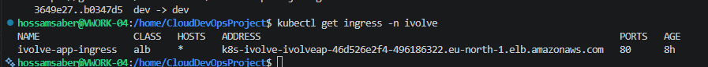

---

# 🔁 GitOps Deployment with ArgoCD

ArgoCD continuously monitors GitHub repository changes and automatically synchronizes Kubernetes manifests with the EKS cluster.

## GitOps Benefits

* Continuous Deployment
* Drift Detection
* Infrastructure Consistency
* Automated Synchronization
* Rollback Capabilities

---

## Install ArgoCD

```bash
kubectl create namespace argocd

kubectl apply --server-side -n argocd \
-f https://raw.githubusercontent.com/argoproj/argo-cd/stable/manifests/install.yaml
```

---

## ArgoCD Login

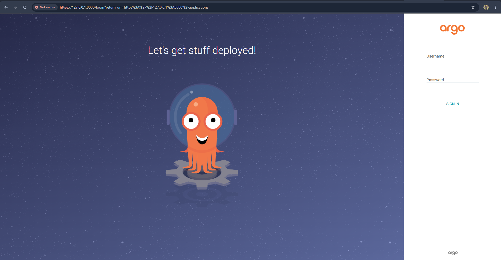

---

## ArgoCD Dashboard

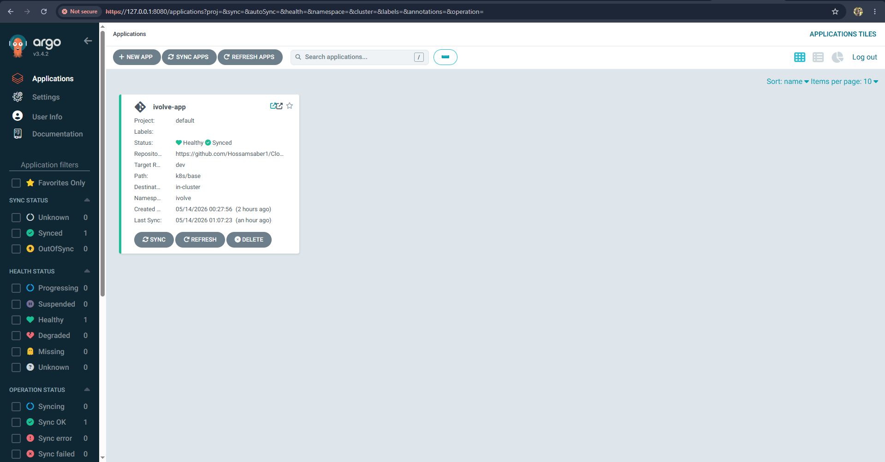

---

# 🌍 Public Application Access

The application was exposed publicly using:

* AWS Load Balancer Controller
* Kubernetes Ingress
* AWS Application Load Balancer (ALB)

---

## Application Homepage

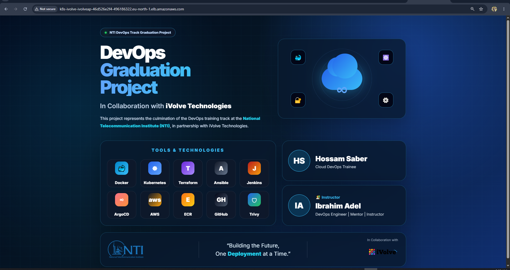

---

## Live Application

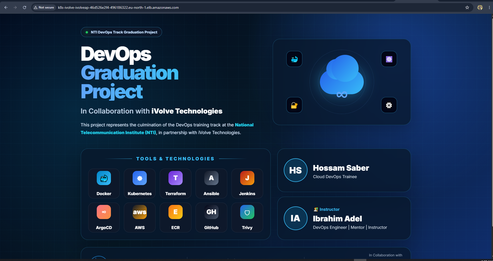

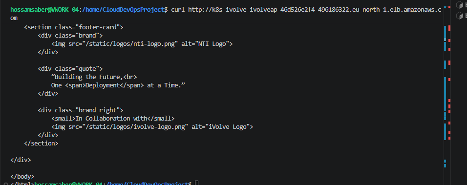

---

## Curl Validation

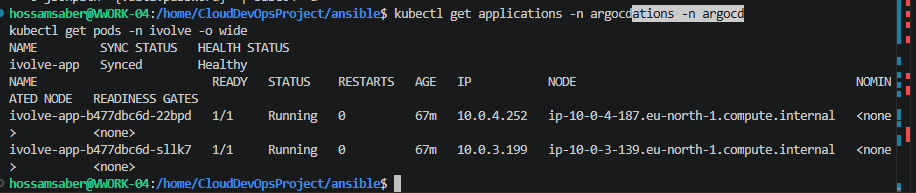

---

# 🔐 Security Implementation

Security scanning was implemented using Trivy during CI pipeline execution.

## Security Features

* Vulnerability Scanning
* Secure Container Delivery
* GitOps Deployment Validation
* Terraform State Locking
* IAM-Based Access Control

---

# 🛠️ Troubleshooting Highlights

## Common Issues Solved

* Kubernetes CrashLoopBackOff
* Jenkins Git Push Errors
* ECR Authentication Issues
* ArgoCD Sync Problems
* AWS Load Balancer Controller Failures
* Terraform State Locking Issues
* Kubernetes Namespace Errors

Detailed troubleshooting documentation available inside:

```text
docs/troubleshooting.md
```

---

# 📈 Future Improvements

* Prometheus Monitoring
* Grafana Dashboards
* HTTPS with ACM
* Route53 Integration
* Horizontal Pod Autoscaler
* Blue-Green Deployment
* Centralized Logging
* Kubernetes Secrets Management
* Multi-Environment Deployments

---

# ✅ Final Result

Successfully implemented:

* Enterprise-Style AWS Infrastructure
* Automated CI/CD Pipeline
* Kubernetes Orchestration
* GitOps Continuous Deployment
* Public Application Exposure
* Secure Container Delivery
* Infrastructure Automation
* Cloud-Native Deployment Workflow

---

# 👨‍💻 Author

## Hossam Saber

### Cloud DevOps Engineer

### Visualization & Render Systems Engineer

### Technologies

* AWS
* Terraform
* Kubernetes
* Jenkins
* Docker
* Ansible
* ArgoCD
* Linux

GitHub:

```text
https://github.com/Hossamsaber1
```
